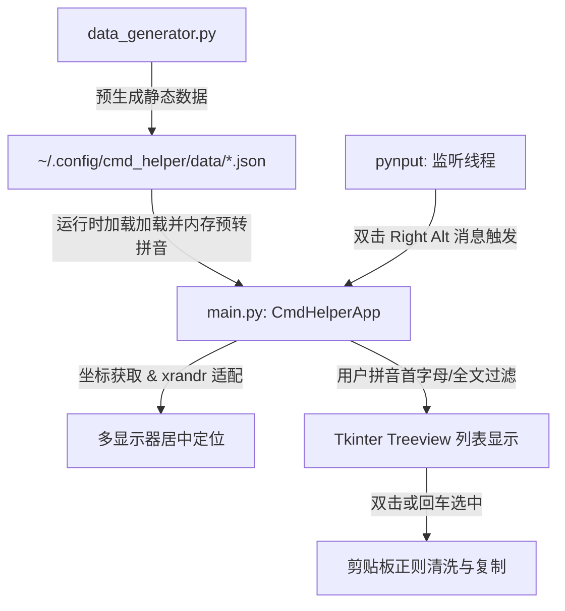

# Command Helper (cmd_helper)

一个为键盘流开发者打造的、支持拼音模糊检索的轻量级快捷键与常用命令桌面辅助工具。

通过全局双击 `Right Alt` 键，程序会以绝对无感的速度（毫秒级）在鼠标当前所在的显示器中央弹出悬浮搜索框。输入拼音或关键字后，即可通过键盘方向键选择并回车，将清理掉注释的干净命令复制到系统剪贴板。

---

## 📂 项目目录结构说明

```bash
cmd_helper/
├── .gitignore          # Git 忽略配置文件（已配置虚拟环境、构建缓存、敏感文件等过滤规则）
├── MEMORY.md           # 项目开发与演进备忘录（记录架构标准与高频命令说明）
├── README.md           # 本文档（项目结构与架构说明书）
├── requirements.txt    # 项目依赖声明（pynput, pypinyin 等）
├── run.sh              # 守护进程启动脚本（支持 4ms 极速 sentinel 依赖检测启动）
├── build.sh            # Linux 下的 PyInstaller 独立二进制打包脚本
├── build.bat           # Windows 下的 PyInstaller 独立二进制打包脚本
├── main.py             # 核心 GUI 交互程序（基于 Tkinter，包含热键监听与多屏定位逻辑）
└── data_generator.py   # 数据生成器（定义各类命令字典，并生成本地数据 JSON）
```

### 核心文件功能介绍：
*   **`main.py`**：程序的入口与主进程。运行一个全局键盘监听线程，并在双击 `Right Alt` 时唤醒主界面的 Tkinter 窗口。内含多显示器位置探测、拼音转化检索、剪贴板清洗算法。
*   **`data_generator.py`**：静态命令数据库源。维护着包括 `Vim`、`Git`、`Lazygit`、`Idea`、`Curl`、`Awk` 等工具的命令结构体，并负责在运行期前将其持久化输出为本地 JSON 数据库。
*   **`run.sh`**：本地启动守护脚本。通过哨兵机制 (`venv/sentinel`) 比较文件修改时间，防止在每次开机或启动时重复运行耗时的 `pip install`，确保毫秒级拉起后台进程，并将输出静默至 `/dev/null`。

---

## 🏗️ 项目架构与技术原理

项目设计遵循**轻量级、无依赖（仅基础库）、高响应速度**的准则。架构可抽象为以下四层：



### 1. 拼音索引与内存缓存设计 (Pinyin Search Indexing)
为了实现输入的瞬时检索：
*   在程序启动（或加载 JSON 数据）时，`main.py` 对各配置条目的 `action` (操作说明) 和 `keywords` (关键字) 通过 `pypinyin` 进行一次性内存翻译。
*   为每条数据预先计算出**全拼 (Full Pinyin)** 和 **首字母缩写 (Initials)**。
*   在用户键入搜索内容时，采用 O(N) 的内存匹配，极大地避开了在检索阶段做拼音转化的 CPU 负载，保证了输入筛选时的极致跟手性。

### 2. 多显示器居中定位逻辑 (Multi-Monitor Centering)
在多屏开发环境下，传统的屏幕居中（以虚拟桌面总长宽居中）会导致窗口卡在两个屏幕的接缝中间。
*   `main.py` 通过调用命令行 `xrandr` 并解析其分辨率与偏移坐标（如 `1920x1080+1920+0`），动态构建当前的显示器几何布局列表。
*   利用 Tkinter 的 `winfo_pointerx()` / `winfo_pointery()` 获取当前鼠标所在的绝对物理坐标。
*   锁定鼠标所处的活动显示器，计算出绝对正中坐标后，通过 `geometry` 命令重新映射定位窗口。

### 3. 剪贴板指令净化算法 (Clipboard Cleaning)
数据库中的命令为了可读性，通常包含中文注释（例如：`git reset --hard HEAD~1 (强行回退并丢弃修改)`）。
*   当用户选中该条目时，`main.py` 会通过正则表达式 `re.split` 按 ` (`、` （` 或 ` 或 ` 进行切分，仅保留最左侧干净的 `git reset --hard HEAD~1` 命令写入剪贴板，防止用户直接粘贴时把备注带入终端导致报错。

---

## 🚀 快速启动与构建

### 1. 依赖安装与后台运行
运行项目目录下的启动脚本：
```bash
chmod +x run.sh
./run.sh
```
*`run.sh` 会自动检测并创建 `./venv`，利用哨兵机制极速拉起后台服务。*

### 2. 编译打包成独立二进制 (可选)
运行打包脚本：
```bash
chmod +x build.sh
./build.sh
```
打包完成后，可在生成的 `./dist` 目录下获得独立的二进制可执行文件 `cmd_helper`。
